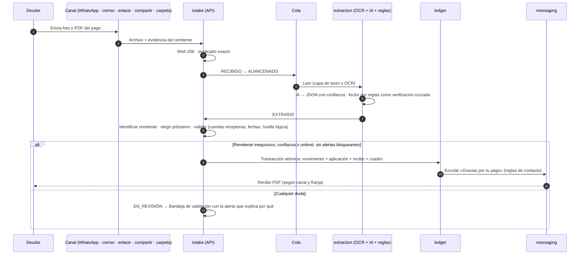
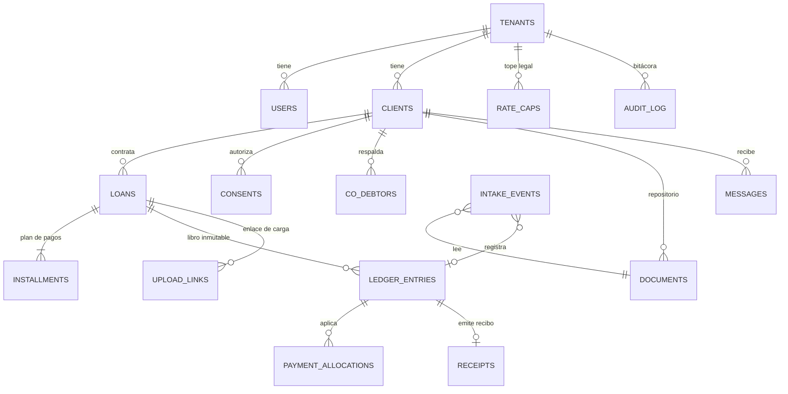

# COROC · Documento de arquitectura (Fase 0)

Versión 0.1 · 22 de septiembre de 2026 · Responde a §24.1-1 del prompt maestro.

## 1. Visión general

COROC tiene tres piezas: apps nativas que muestran y supervisan, un servidor que ejecuta toda la automatización y un núcleo de negocio probado que ambos comparten. La regla central (§4.3): **las automatizaciones corren en el servidor**, así que un comprobante que llega a las 3 p. m. se lee, se registra y genera su recibo aunque el celular y el PC del usuario estén apagados.

```mermaid
flowchart LR
  subgraph Clientes
    A1[App Android]:::app
    A2[App iOS / iPadOS]:::app
    A3[App Windows]:::app
    A4[App macOS]:::app
    P[Portal del deudor<br/>web responsiva]:::web
  end
  subgraph Servidor COROC
    API[API NestJS<br/>REST + SSE]:::srv
    W[Workers BullMQ<br/>intake · OCR · PDF · mensajes · respaldos]:::srv
    CORE[[@coroc/core<br/>motor financiero · reglas · lectura]]:::core
    DB[(PostgreSQL 16<br/>RLS por empresa)]:::db
    R[(Redis)]:::db
    S3[(Almacenamiento S3/R2<br/>cifrado)]:::db
  end
  subgraph Proveedores
    WA[WhatsApp Cloud API<br/>modo A, sujeto a Meta]:::ext
    EM[Correo: SES / Postmark<br/>Gmail · Microsoft Graph]:::ext
    OCR[OCR: Document AI / Textract /<br/>Azure Document Intelligence]:::ext
    AI[IA con visión<br/>salida JSON]:::ext
  end
  A1 & A2 & A3 & A4 -->|HTTPS + JWT| API
  P -->|token del enlace| API
  API --> CORE
  W --> CORE
  API --> DB & R & S3
  W --> DB & R & S3
  WA -->|webhook firmado| API
  API -->|plantillas aprobadas| WA
  EM -->|entrada| API
  W --> EM & OCR & AI
  classDef app fill:#130E42,color:#FFFDE7,stroke:#CAA555
  classDef web fill:#2A2466,color:#FFFDE7,stroke:#CAA555
  classDef srv fill:#FFFDE7,color:#130E42,stroke:#A57E33
  classDef core fill:#E9C879,color:#130E42,stroke:#A57E33
  classDef db fill:#F6F6F6,color:#130E42,stroke:#8A6A2B
  classDef ext fill:#ffffff,color:#5B5878,stroke:#B8B4D6,stroke-dasharray:4 3
```

## 2. Componentes

| Componente | Tecnología | Responsabilidad |
|---|---|---|
| Apps | Flutter (canal stable) + Dart 3, Riverpod, go_router, drift + SQLCipher | Interfaz, caché offline de lectura, cola de operaciones sin conexión, carpeta local COROC, hoja de compartir, biometría |
| API | Node.js 22 LTS + TypeScript + NestJS | Autenticación, permisos, validación, transacciones contables, eventos en tiempo real (SSE) |
| Workers | BullMQ sobre Redis | Pipeline de comprobantes, OCR e IA, PDF, mensajes programados, respaldos, mora diaria |
| Núcleo `@coroc/core` | TypeScript puro (decimal.js, libphonenumber-js) | Plan de pagos, aplicación de pagos, tasa efectiva y tope, reglas de contacto, identificación del remitente, antiduplicado, lectura por reglas, datos del recibo |
| Base de datos | PostgreSQL 16 | Fuente de verdad; RLS por empresa; libro y bitácora inmutables; antiduplicado por índice único |
| Archivos | S3 o R2 con cifrado en reposo | Comprobantes, recibos, planes, estados de cuenta, respaldos; URLs firmadas de corta duración |
| PDF | Plantillas HTML/CSS + Chromium (Playwright) | Recibos y documentos con tipografía editorial |
| Portal del deudor | Web responsiva | Plan de pagos y carga del comprobante con enlace personal firmado |

### Módulos del backend (§4.4)
`auth` · `tenants` · `users` · `clients` · `loans` · `ledger` · `documents` · `intake` · `extraction` · `messaging` · `compliance` · `receipts` · `reports` · `dashboard` · `backup` · `audit` · `i18n`. Cada módulo expone servicios; la lógica de dinero y reglas vive solo en `@coroc/core` para que no haya dos implementaciones.

## 3. Flujo del comprobante (§12–§14)



Si el lector por reglas y la IA discrepan en valor o fecha, el elemento va a revisión aunque la confianza sea alta (ADR-017).

## 4. Modelo de datos

El modelo completo, con índices y políticas RLS, está en `services/api/db/schema.sql`. Resumen:



Garantías en la base (verificadas en PostgreSQL 16.14, ver `services/api/db/test/resultado-postgres16.json`):
- Una empresa no puede leer ni escribir datos de otra (CA-17).
- `ledger_entries`, `payment_allocations` y `audit_log` rechazan UPDATE y DELETE.
- Un reverso exige motivo y un pago solo puede reversarse una vez.
- Un comprobante no puede quedar aplicado dos veces (índice único parcial sobre la huella lógica y sobre el SHA-256).
- Los topes de tasa no pueden tener vigencias solapadas.
- En cada cuota, capital + interés = valor de la cuota.

## 5. Seguridad (§7)

| Tema | Diseño |
|---|---|
| Contraseñas | Argon2id en el servidor; 12 caracteres mínimo; lista de contraseñas filtradas; bloqueo 15 min tras 5 intentos |
| Sesión | Acceso JWT 15 min + renovación rotativa ligada al dispositivo (hash en `sessions`); cierre remoto |
| Segundo factor | TOTP, obligatorio para Propietario |
| Aislamiento | `SELECT set_config('app.tenant_id', …, true)` por transacción + RLS forzado; rol `coroc_app` sin BYPASSRLS ni DELETE contable |
| Cifrado | TLS 1.3; AES-256 en reposo (base, objetos, respaldos); SQLCipher en el dispositivo; Keychain / Keystore / DPAPI |
| Bitácora | Quién, qué, cuándo, dispositivo, antes y después; inmutable |
| Datos personales | Minimización, consentimiento por canal con evidencia, exclusión inmediata, sin datos personales en logs |
| Verificación | OWASP ASVS nivel 2 (API) y MASVS L2 (móvil); prueba de penetración en Fase 5 |

## 6. Mensajería y cumplimiento (§11)

- **Modo B, asistido (activo por defecto):** COROC redacta y programa; el usuario confirma con un toque (`wa.me`, hoja de compartir con el PDF, `mailto:`). No depende de Meta.
- **Modo A, automático (Cloud API):** se implementa completo en Fase 4 y se activa solo con lista de verificación y aceptación del propietario, porque la Política de Mensajería de WhatsApp Business prohíbe la cobranza de deudas y los préstamos entre pares sin importar las licencias. Si Meta suspende la cuenta, COROC vuelve al modo B sin perder mensajes (CA-20).
- **Prohibido:** automatizar WhatsApp Web con librerías no oficiales.
- **Motor de reglas de contacto:** `evaluateContact` en `@coroc/core`, preset Colombia Ley 2300 de 2023 (franjas, festivos, un contacto de cobranza por día, un canal por semana, excepción autorizada por el deudor). Cada decisión se guarda en `messages.decision`.
- **Tope de tasa:** `checkRateCap` calcula la tasa efectiva anual real (TIR sobre fechas) y bloquea préstamos por encima del tope vigente (`rate_caps`).

## 7. Carpeta COROC por plataforma (§16.2)

| Plataforma | Mecanismo | Permiso |
|---|---|---|
| Windows | Ruta elegida por el usuario (sugerida `Documentos/COROC`) | Diálogo propio de COROC antes de crear la carpeta |
| macOS | `NSOpenPanel` + marcador de seguridad | Marcador persistente |
| Android | Storage Access Framework (`ACTION_OPEN_DOCUMENT_TREE`) + `takePersistableUriPermission` | Nunca `MANAGE_EXTERNAL_STORAGE` |
| iOS / iPadOS | Carpeta en «Archivos › En mi iPhone › COROC» (`UIFileSharingEnabled`, `LSSupportsOpeningDocumentsInPlace`) | Sin permiso adicional |
| Prototipo web | File System Access (Chrome/Edge de escritorio); ZIP en los demás navegadores | Diálogo del navegador |

Estructura: `COROC/<Nombre Apellidos - Código>/<Contrato>/{01 … 05}` más `_Sin asignar`, `_Entrada`, `_Informes`, `_Respaldos`. Los nombres de carpeta van sin tildes (ADR-013). Cada carpeta de cliente guarda `.coroc-id` para sobrevivir a cambios de nombre.

**Fase 2:** así quedó implementado en la app Flutter (ADR-036). El plugin `coroc_bookmarks` maneja los marcadores de macOS, y `saf_util`/`saf_stream` el acceso en Android. La carpeta es un espejo del repositorio del servidor, que guarda los archivos cifrados (ADR-031) y genera los PDF con Chromium desde una bandeja de salida transaccional (ADR-032, ADR-033).

## 8. Núcleo compartido `@coroc/core`

`packages/core` es la única implementación de las reglas de dinero y de cumplimiento. Lo usan la API, los workers y el prototipo web (empaquetado con esbuild). Las apps Flutter no recalculan: piden `POST /loans/preview` y leen resultados de la API.

| Módulo | Contenido |
|---|---|
| `money` | Unidades mínimas, redondeo mitad hacia arriba, formato por moneda |
| `calendar` | Festivos CO/BR/US 2025–2031 versionados (`holidays.json`), días de cobro, meses con día inexistente |
| `schedule` | Interés simple fijo y cuota fija (francés), unidad de redondeo, última cuota absorbe la diferencia |
| `allocation` | Mora → cuotas cronológicas → saldo a favor; resumen, días de mora, causación de mora |
| `rate` | Tasa efectiva anual por TIR, tope legal, tasa máxima que cumple, mora frente al tope |
| `compliance` | Motor de reglas de contacto (Ley 2300 de 2023) |
| `intake` | Normalización E.164, identificación del remitente, elección de préstamo, huellas, validaciones, decisión |
| `extraction` | Lector de comprobantes por reglas (es, pt-BR, en) |
| `receipt` | Datos y textos del recibo en tres idiomas |

Estado: 41 pruebas en verde, cobertura de sentencias 96 %.

## 9. Versiones y dependencias externas

| Dependencia | Versión | Nota |
|---|---|---|
| Node.js | 22 LTS | Verificado en 22.22 |
| PostgreSQL | 16 | Esquema verificado en 16.14 |
| TypeScript | 5.x | |
| Flutter | canal stable vigente al iniciar la Fase 1 | Se fija en `pubspec.lock` |
| NestJS | versión mayor vigente al iniciar la Fase 1 | Se fija en `package-lock.json` |
| WhatsApp Cloud API (Graph API) | versión vigente al activar el modo A | Se fija en `WHATSAPP_GRAPH_VERSION`; no se usa sin aprobación de Meta |
| Tesseract.js (prototipo) | 5.1.1 | Carga bajo demanda desde CDN |
| PDF.js (prototipo) | 4.10.38 | Carga bajo demanda desde CDN |

Las versiones «vigente al iniciar» se registran en `docs/DECISIONES.md` en el momento de fijarlas: la regla 2 del prompt prohíbe inventarlas por adelantado.

## 10. Estructura del monorepo

```
coroc/
├── apps/
│   ├── prototype/        App funcional en un archivo HTML (Fase 0, wireframes navegables)
│   └── coroc_app/        App Flutter (Fase 1)
├── services/api/
│   ├── openapi.yaml      Contrato OpenAPI 3.1 (59 operaciones, validado con Redocly)
│   └── db/               schema.sql + pruebas en PostgreSQL 16
├── packages/core/        @coroc/core con pruebas (vitest)
├── brand/                Logo vectorizado, variantes, íconos de app
└── docs/                 Arquitectura, decisiones, criterios, supuestos, pantallas
```

## 11. Despliegue (Fase 1 en adelante)

Contenedores Docker para API y workers; PostgreSQL gestionado con réplicas y PITR (RPO 1 h); Redis gestionado; almacenamiento S3/R2 con versionado; Terraform para toda la infraestructura; CI con pruebas, lint de traducciones (cero textos sin traducir) y análisis estático; observabilidad con OpenTelemetry y Sentry con traza por documento desde la recepción hasta el recibo enviado.
