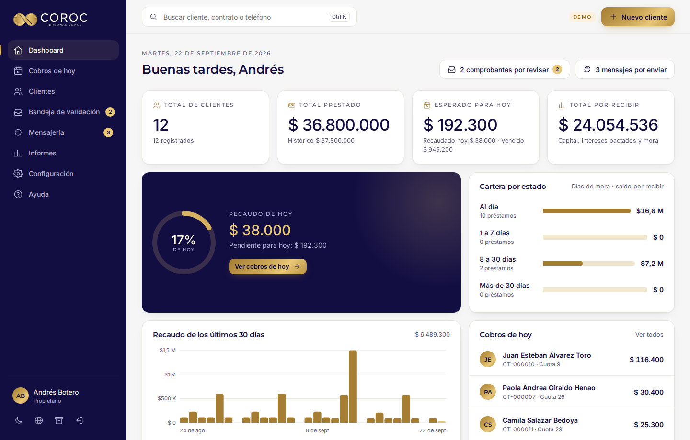
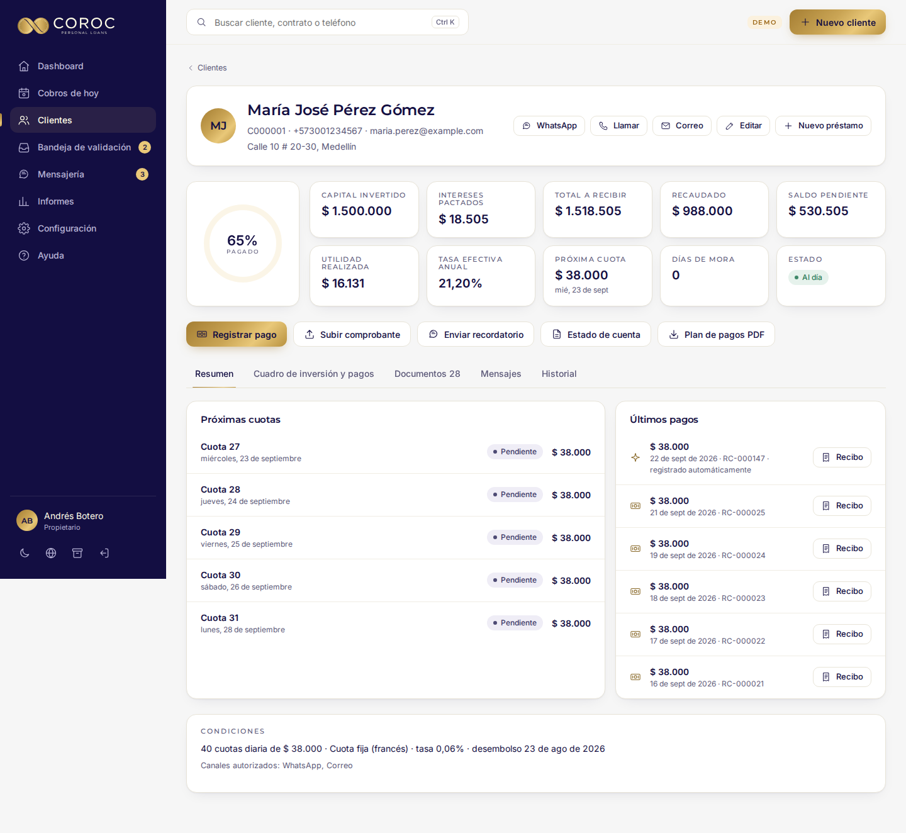
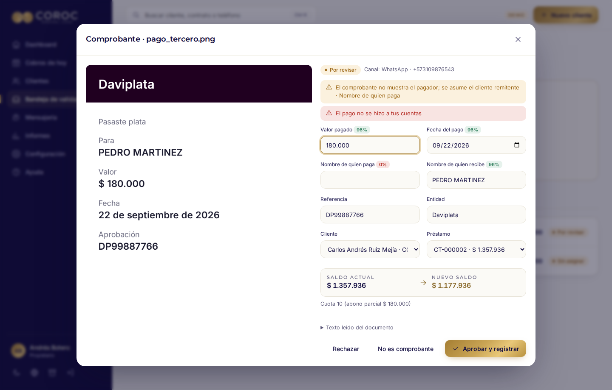
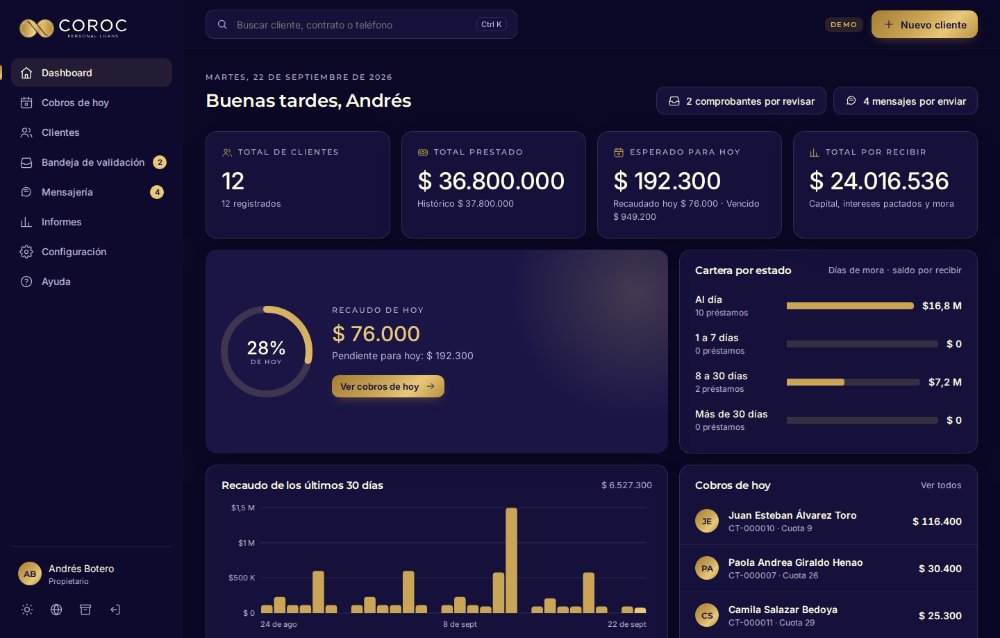

# COROC · Mapa de pantallas (§5.7 y §24.1-4)

Los wireframes se entregan como pantallas reales de la app funcional (`apps/prototype/dist/COROC.html`), con el sistema de diseño de §5 aplicado: paleta del logo, Montserrat e Inter empaquetadas, modos Marfil y Medianoche, y diseño adaptable a escritorio y móvil (ADR-016). Las capturas se regeneran con `node tools/e2e.mjs` y los datos son de demostración.

| # | Pantalla (§5.7) | Capturas | Qué validar |
|---|---|---|---|
| 1 | Ingreso | `50-mobile-login.png` · `00-setup.png` | Logotipo completo centrado, usuario y contraseña, «Recordarme», selector de idioma visible. La primera vez se crea el Propietario |
| 2 | Primer uso (asistente) | `01-onboarding-0.png` → `04-onboarding-compliance.png` | Idioma y empresa → cuentas receptoras → permiso para crear la carpeta COROC → canales → reglas de contacto y tope de tasa |
| 3 | Dashboard | `10-dashboard.png` · `30-dashboard-dark.png` · `40-dashboard-pt-BR.png` · `40-dashboard-en.png` · `51-mobile-dashboard.png` | Cuatro cifras protagonistas con conteo animado, anillo de recaudo de hoy, tendencia de 30 días, cartera por estado, cobros de hoy |
| 4 | Cobros de hoy | `11-today.png` | Cuotas de hoy y vencidas, pago en efectivo en dos toques, recordatorio |
| 5 | Clientes | `12-clients.png` | Búsqueda instantánea y filtros (al día, en mora, frecuencia, finalizados) |
| 6 | Nuevo cliente | `24-new-client.png` | Asistente de 3 pasos con vista previa en vivo, tasa efectiva anual y control del tope |
| 7 | Ficha del cliente | `13-client.png` · `14-client-schedule.png` · `15-client-docs.png` · `16-client-msgs.png` · `31-client-dark.png` · `52-mobile-client.png` | Resumen con tarjetas y anillo de avance · Cuadro de inversión y pagos · Documentos · Mensajes · Historial |
| 8 | Bandeja de validación | `17-inbox.png` · `18-inbox-review.png` · `53-mobile-inbox.png` | Vista dividida: imagen original, campos con confianza, cliente y préstamo, saldo antes y después; aprobar con Enter |
| 9 | Mensajería | `19-messages.png` · `20-templates.png` | Cola por enviar, bloqueados con la regla aplicada, historial, plantillas en tres idiomas con vista previa y validador |
| 10 | Informes | `21-reports.png` | Cartera, recaudo, mora por edades, finalizados, flujo proyectado, libro, bitácoras (PDF y CSV) |
| 11 | Configuración | `22-settings.png` | Empresa, usuarios y roles, cuentas receptoras, canales, cumplimiento, numeraciones, idioma, apariencia, carpeta COROC, respaldo |
| 12 | Ayuda | `23-help.png` | Guía de uso y decisiones documentadas |
| — | Registro de pago | `25-payment-dialog.png` · `26-after-payment.png` | Vista previa de la cobertura exacta antes de confirmar; recibo emitido al instante |
| — | Recibo PDF (§15) | `muestras/01_Recibo_es.pdf` · `muestras/02_Receipt_en.pdf` · `muestras/07_Recibo_ANULADO.pdf` | A5 vertical, fondo marfil, filete dorado, valor pagado y nuevo saldo como protagonistas, QR de verificación |

## Vista previa

